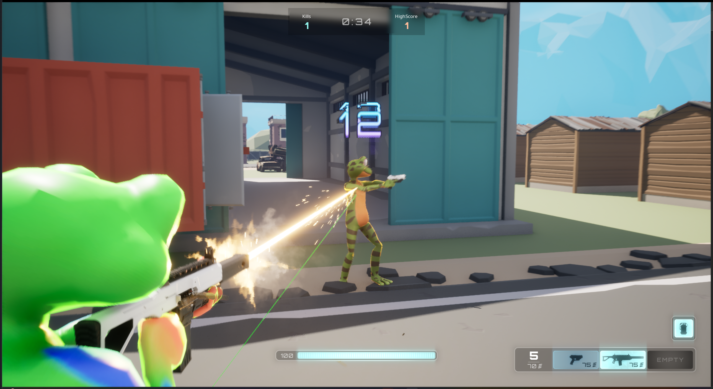

Welcome to the latest update from our studio! We're excited to introduce you to our project, "**Frog of War**," a thrilling multiplayer experience set in a world of amphibious warfare. Developed using the cutting-edge [Unreal Engine 5](https://www.unrealengine.com/en-US/unreal-engine-5), this game is a simple and modern take on multiplayer first-person shooters.

Prepare yourselves for an action-packed adventure as we plunge you into the heart of the battle, taking on the persona of agile and fearless frogs. This isn't your typical first-person shooter; it's an entirely unique and captivating concept that will keep you hooked from the first leap!

<!--truncate-->

As you dive into the game, you'll be able to choose from a variety of game modes that cater to different playstyles. Engage in intense deathmatches where reflexes and precision are your best allies, or opt for the adrenaline-pumping excitement of our battle royale mode, where only the toughest amphibians will survive!

But that's not all; we have even more surprises in store! Our team has been hard at work crafting an array of innovative game modes that will challenge your strategy, teamwork, and skills. Whether you're a seasoned gamer or a newcomer to the battlefield, there's something here for everyone!

As we continue developing "Frog of War," we remain committed to delivering a fun, polished, and enjoyable experience for all our players. We're eagerly anticipating the day when you can join us in this incredible adventure and experience firsthand the excitement, camaraderie, and fierce competition that awaits in our frog-filled universe.

Stay tuned for more updates, as we'll be sharing behind-the-scenes peeks, gameplay teasers, and further announcements on our journey to release! Thank you for your support, and we can't wait to hop into action with you in "Frog of War!"