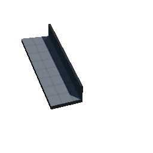

# Architecture

Cell Snap Actors using <HL>AP2BTCellSnapActors</HL>

## Floors

    <CaptionWrapper caption="Floor_Full_A"></CaptionWrapper>
    <CaptionWrapper caption="Floor_Half_A"></CaptionWrapper>
    <CaptionWrapper caption="Floor_Quarter_A"></CaptionWrapper>

## Walls

    <CaptionWrapper caption="Archway_A"></CaptionWrapper>
    <CaptionWrapper caption="Archway_Bottom_A"></CaptionWrapper>
    <CaptionWrapper caption="Wall_DoorOnEdge_A"></CaptionWrapper>
    <CaptionWrapper caption="Wall_Full_A_Curved_4divisions_A"></CaptionWrapper>
    <CaptionWrapper caption="Wall_Full_A_Curved_12divisions_A"></CaptionWrapper>
    <CaptionWrapper caption="Wall_Full_A_Door_Center_A"></CaptionWrapper>
    <CaptionWrapper caption="Wall_Full_A_Door_WindowOffset_A"></CaptionWrapper>
    <CaptionWrapper caption="Wall_Full_A_DoorOffset_A"></CaptionWrapper>
    <CaptionWrapper caption="Wall_Full_A"></CaptionWrapper>
    <CaptionWrapper caption="Wall_Full_A_Pipe_Large_Cut"></CaptionWrapper>
    <CaptionWrapper caption="Wall_Full_A_Window_Double_A"></CaptionWrapper>
    <CaptionWrapper caption="Wall_Full_A_Window_Side_A"></CaptionWrapper>
    <CaptionWrapper caption="Wall_Full_A_Window_Wide_A"></CaptionWrapper>
    <CaptionWrapper caption="Wall_Full_AGarage_Open_A"></CaptionWrapper>
    <CaptionWrapper caption="Wall_Full_C_Door_Center_A"></CaptionWrapper>
    <CaptionWrapper caption="Wall_Full_C_Door_Offset_A"></CaptionWrapper>
    <CaptionWrapper caption="Wall_Full_C"></CaptionWrapper>
    <CaptionWrapper caption="Wall_Full_EndCap_A"></CaptionWrapper>
    <CaptionWrapper caption="Wall_Half_A"></CaptionWrapper>
    <CaptionWrapper caption="Wall_Half_EndCap_A"></CaptionWrapper>
    <CaptionWrapper caption="Wall_Half_Quarter_A"></CaptionWrapper>
    <CaptionWrapper caption="Wall_Quarter_A"></CaptionWrapper>
    <CaptionWrapper caption="Wall_Quarter_B"></CaptionWrapper>
    <CaptionWrapper caption="Wall_Quarter_EndCap_A"></CaptionWrapper>
    <CaptionWrapper caption="Wall_Quarter_EndCap_B"></CaptionWrapper>
    <CaptionWrapper caption="Wall_Quarter_Half_A"></CaptionWrapper>
    <CaptionWrapper caption="Wall_Quarter_Half_B"></CaptionWrapper>
    <CaptionWrapper caption="Wall_Sixth_A"></CaptionWrapper>
    <CaptionWrapper caption="Wall_Sixth_Eighth_A"></CaptionWrapper>
    <CaptionWrapper caption="Wall_Sixth_EndCap_A1"></CaptionWrapper>
    <CaptionWrapper caption="Wall_Sixth_Half_A"></CaptionWrapper>
    <CaptionWrapper caption="Wall_Sixth_Quarter_A"></CaptionWrapper>
    <CaptionWrapper caption="Wall_Third_A"></CaptionWrapper>
    <CaptionWrapper caption="Wall_Third_EndCap_A"></CaptionWrapper>
    <CaptionWrapper caption="Wall_Third_Half_A"></CaptionWrapper>

## Roofs

    <CaptionWrapper caption="T_P2_Roof_Support_A_Icon.PNG"></CaptionWrapper>
    <CaptionWrapper caption="T_P2_Roof_Brace_A_Icon.PNG"></CaptionWrapper>
    <CaptionWrapper caption="T_P2_Roof_Center_A_Icon.PNG"></CaptionWrapper>
    <CaptionWrapper caption="T_P2_Roof_Corner_A_Icon.PNG"></CaptionWrapper>
    <CaptionWrapper caption="T_P2_Roof_Corner_Invert_A_Icon.PNG"></CaptionWrapper>
    <CaptionWrapper caption="T_P2_Roof_Corner_Overhang_A_Icon.PNG"></CaptionWrapper>
    <CaptionWrapper caption="T_P2_Roof_Straight_A_Icon.PNG"></CaptionWrapper>

## Shapes

    <CaptionWrapper caption="Block_Cube_64x64x64_A_Icon"></CaptionWrapper>
    <CaptionWrapper caption="Block_Cube_128x128x128_A"></CaptionWrapper>
    <CaptionWrapper caption="Block_Cube_256x256x256_A"></CaptionWrapper>
    <CaptionWrapper caption="Block_Cube_Bottom_A"></CaptionWrapper>
    <CaptionWrapper caption="Block_Cube_Full_A"></CaptionWrapper>
    <CaptionWrapper caption="Block_Cube_Side_A"></CaptionWrapper>
    <CaptionWrapper caption="Block_Curve_A"></CaptionWrapper>
    <CaptionWrapper caption="Block_Curve_Corner_A"></CaptionWrapper>
    <CaptionWrapper caption="Block_Curve_Inverted_A"></CaptionWrapper>
    <CaptionWrapper caption="Block_Curve_Inverted_Corner_A"></CaptionWrapper>
    <CaptionWrapper caption="Block_Pyramind_A"></CaptionWrapper>
    <CaptionWrapper caption="Block_Pyramind_Half_A"></CaptionWrapper>
    <CaptionWrapper caption="Block_Ramp_A"></CaptionWrapper>
    <CaptionWrapper caption="Block_Ramp_Half_A"></CaptionWrapper>
    <CaptionWrapper caption="Block_Ramp_Half_Raised_A"></CaptionWrapper>
    <CaptionWrapper caption="Block_Sphere_384_A"></CaptionWrapper>
    <CaptionWrapper caption="Block_Wedge_Slanted_A"></CaptionWrapper>
    <CaptionWrapper caption="Block_Wedge_Slanted_Elevated_A"></CaptionWrapper>
    <CaptionWrapper caption="Block_Wedge_Slanted_Half_A"></CaptionWrapper>
    <CaptionWrapper caption="Block_Wedge_Slanted_Inverted_A"></CaptionWrapper>
    <CaptionWrapper caption="Block_Wedge_Slanted_Inverted_Elevated_A"></CaptionWrapper>

## Pipes

    <CaptionWrapper caption="Pipe_Large_Corner_A"></CaptionWrapper>
    <CaptionWrapper caption="Pipe_Large_Intersection_A"></CaptionWrapper>
    <CaptionWrapper caption="Pipe_Large_Straight_A"></CaptionWrapper>
    <CaptionWrapper caption="Wall_Full_A_Pipe_Large_Cu"></CaptionWrapper>

## Stairs

    <CaptionWrapper caption="Stair_Forward_A_Icon"></CaptionWrapper>
    <CaptionWrapper caption="Stair_Forward_B_Icon"></CaptionWrapper>
    <CaptionWrapper caption="Stair_Forward_Rail_A_Icon"></CaptionWrapper>
    <CaptionWrapper caption="Stair_Right_A_Icon"></CaptionWrapper>
    <CaptionWrapper caption="Stair_Right_Rail_A_Icon"></CaptionWrapper>
    <CaptionWrapper caption="Stair_T_A_Icon"></CaptionWrapper>
    <CaptionWrapper caption="Stair_T_Rail_A_Icon"></CaptionWrapper>
    <CaptionWrapper caption="Stair_Wide_A_Icon"></CaptionWrapper>
    <CaptionWrapper caption="Stair_Wide_Rail_A_Icon"></CaptionWrapper>

## Columns

    <CaptionWrapper caption="Column_A"></CaptionWrapper>
    <CaptionWrapper caption="Column_Half_24_A"></CaptionWrapper>
    <CaptionWrapper caption="Column_Medium_A"></CaptionWrapper>
    <CaptionWrapper caption="Column_Rectangle_A"></CaptionWrapper>
    <CaptionWrapper caption="Column_Thick_A"></CaptionWrapper>

## Balconies

    <CaptionWrapper caption="Balcony_Angle_A"></CaptionWrapper>
    <CaptionWrapper caption="Balcony_Angle_Rail_A"></CaptionWrapper>
    <CaptionWrapper caption="Balcony_Corner_Curved_A"></CaptionWrapper>
    <CaptionWrapper caption="Balcony_Corner_Curved_Rail_A"></CaptionWrapper>
    <CaptionWrapper caption="Balcony_L_Corner_A"></CaptionWrapper>
    <CaptionWrapper caption="Balcony_L_Corner_Rail_A"></CaptionWrapper>
    <CaptionWrapper caption="Balcony_Straight_Half_A"></CaptionWrapper>
    <CaptionWrapper caption="Balcony_Straight_Half_Rail_A"></CaptionWrapper>

## Doors

:::note

Will add basic prototyping functionality to doors in a future version.
Doesn't currently use <HL>AP2BTCellSnapActors</HL>

:::

    <CaptionWrapper caption="Door_Basic_WithKnob_A"></CaptionWrapper>
    <CaptionWrapper caption="Door_Block_A"></CaptionWrapper>

