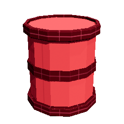
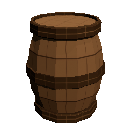
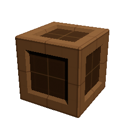
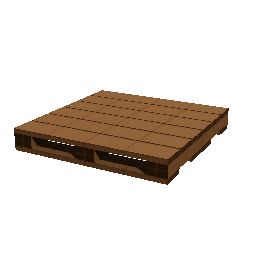
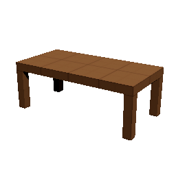
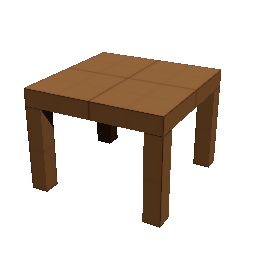

# Props++

Loose static meshes for now. 

## Props and Furniture

:::note
Props weren't a priority in V1 release of P2BT.  Will add additional basic prototype props in an upcoming version.
:::

    <CaptionWrapper caption="Prop_Barrel_A"></CaptionWrapper>
    <CaptionWrapper caption="Prop_Barrel_B"></CaptionWrapper>
    <CaptionWrapper caption="Prop_Box_A"></CaptionWrapper>
    <CaptionWrapper caption="Prop_Pallet_A"></CaptionWrapper>
    <CaptionWrapper caption="Furniture_Table_Long_A"></CaptionWrapper>
    <CaptionWrapper caption="Furniture_Table_Square_Small_A"></CaptionWrapper>

:::note

Also, see 'Shapes' for other generic shapes to be used as props

:::

