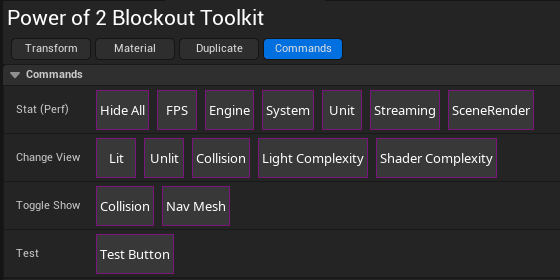
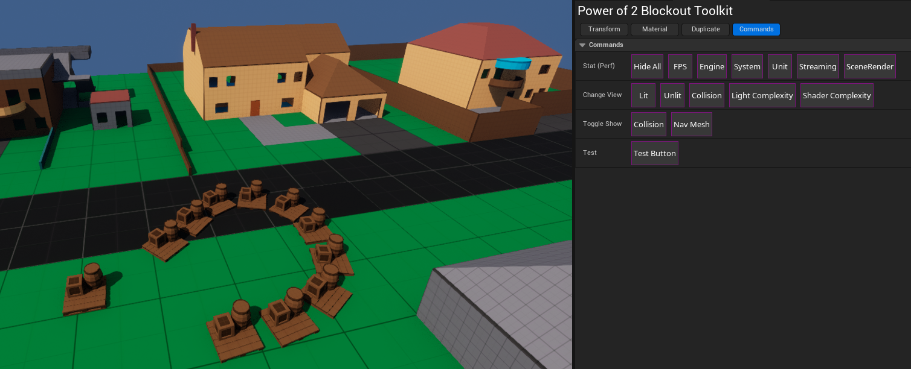
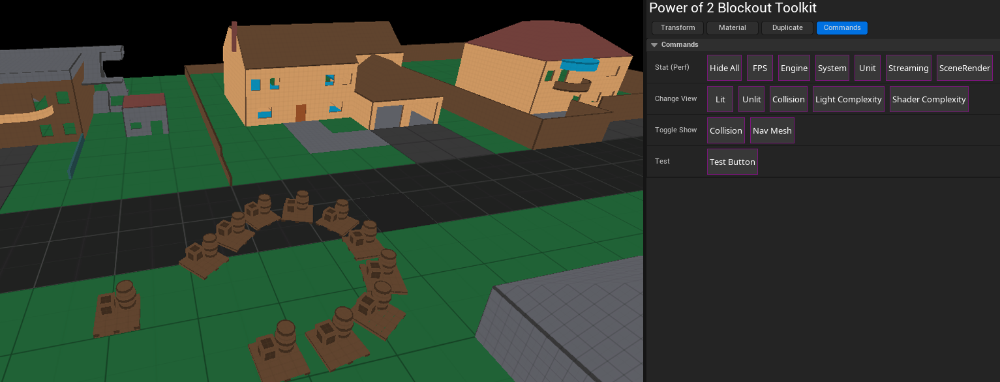
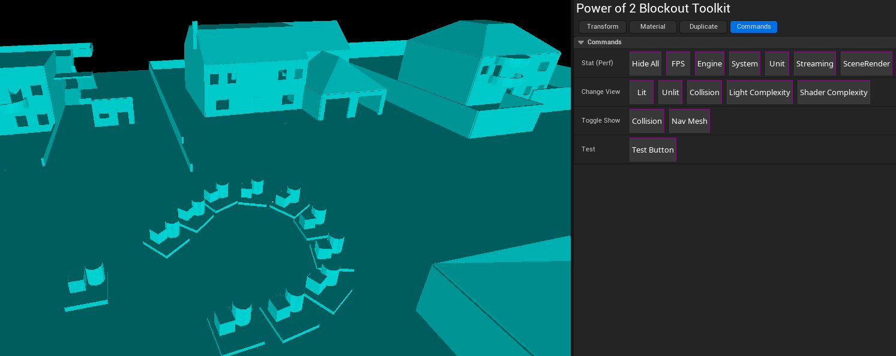
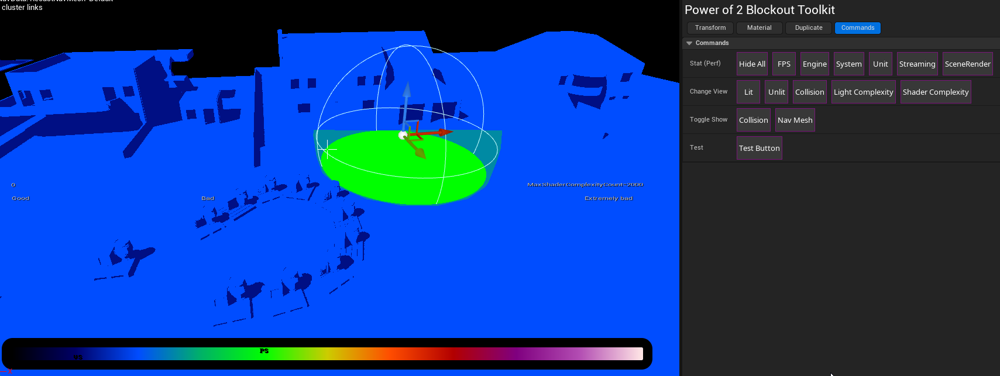
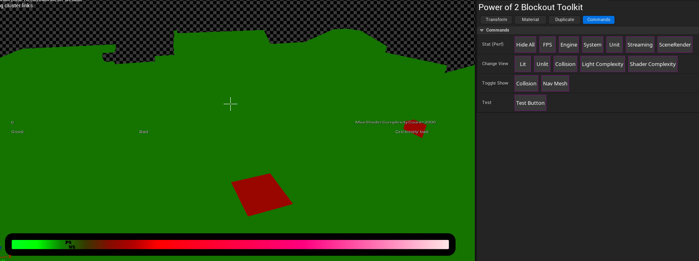
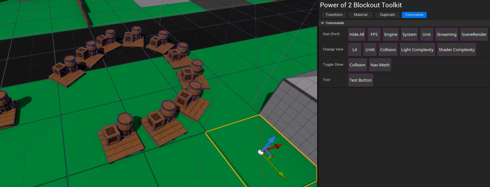
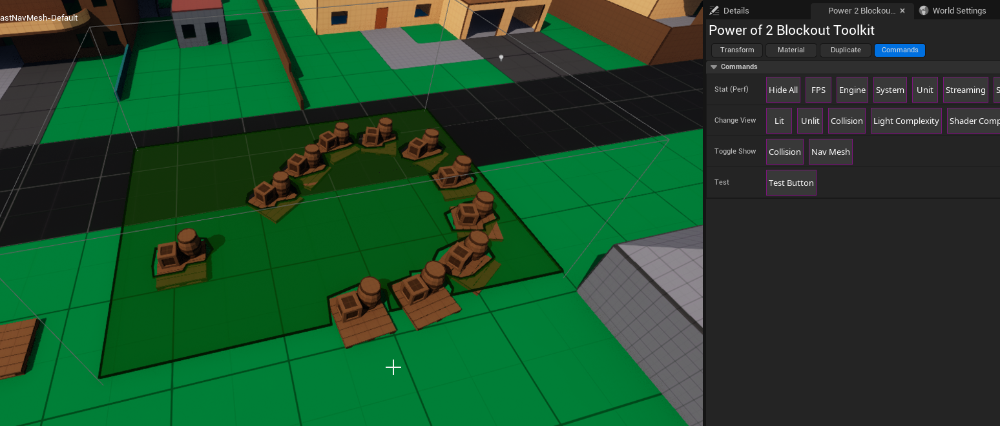

# Commands

## Stat (Perf)

Select one of the stat choices to toggle the respective performance statistics.

FPS (Frames per Second), Engine, System, Unit, Streaming, Scene Render
Hide All will hide them all. 

## Change View

### Lit: Standard lit view

### Unlit: Standard unlit view

### Collision: Allows you to see all the collision. 

### Light Complexity: Allows you to see the approximate complexity costs of lights in the scene.

### Shader Complexity: Allows you to see vertex and pixel shader costs

:::Info Tip
In the above case, the 2 red were from duplicated assets in the same location.
Because of this view, I could find and delete them

## Toggle Show

### Collision: Toggle collision's visibility

### Nav Mesh: Toggle nav mesh's visibility

:::info Tip
This is toggling between 'force show' and 'user selected'. 
This can sometimes cause some confusion, under Show in the viewport, you can see if it's user selected or try hitting UE default hotkey: `P`
:::

## Requests
Please join the discord if you'd like to request to see additional commands here.
More will likely be added in time.

Discord name: Broken Rock Studios
Discord Invite: https://discord.gg/P6tejWKrgq
