# Duplicate Tab

## Grid

Duplicates the selected actors into a grid. 

Example using multiple actors, x2, y2, z3 and offset 512x512x384 (standard cell size)

Before:

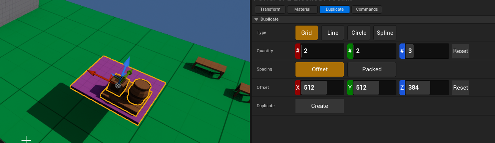

After:

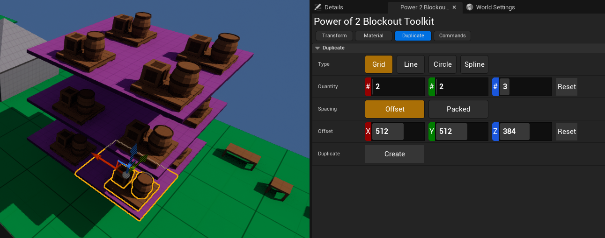

Example using Grid Packed, x5, y3, z1.
Will use bounding box of each item to pack it in.

Before:

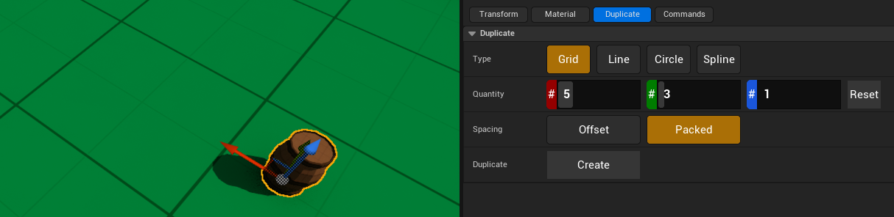

After:

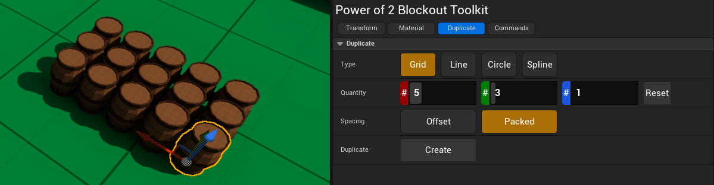

## Line

Duplicates the selected actors into a line.
Note: Supports packing. Will use bounding boxes to attempt to be as compact as possible.

Example: Using quantity 5 withi offset (300,128,0).

Before:

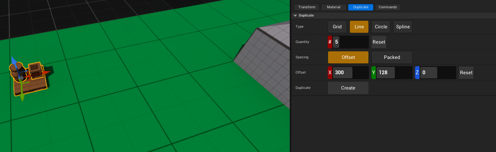

After:

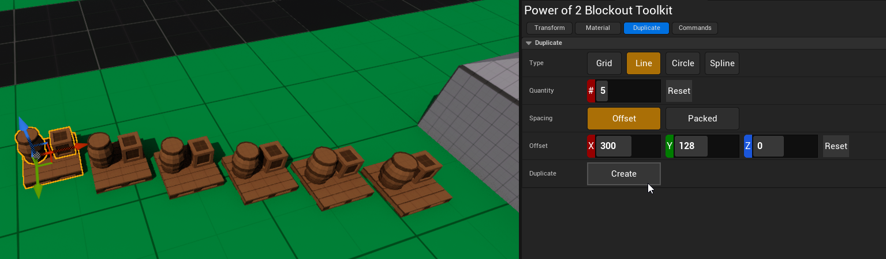

## Circle

Duplicates the selected actors around the target actor in a circle. 

Note: Doesn't take into account original duplicated assets locations. 

Example: 

1. Select a target object, in this case S_Prop_Barrel_B2, with a quantity of 6 and 500 offset
2. Select the objects you want duplicated, in this case a barrel, crate, and pallet.
   * Optionally choose to delete original. 
3. Hit Create!

Before:

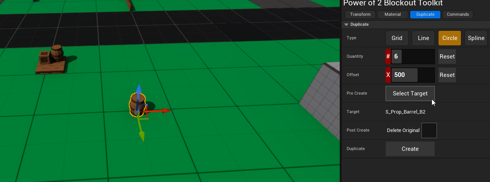

After:

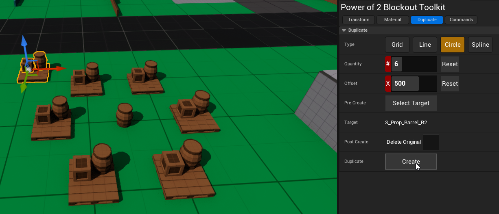

## Spline

Duplicates the selected actors along a spline.

1. Create a spline, use duplicate/extrude to add additional points to the spline.
   * Will automatically set Target Actor to created spline
2. Select a target spline if non are selected.
3. Select actors you wish to duplicate.
4. Duplicate!

Example:

1. Select an object in your viewport and Generate Spline.  
If no object is selected, the spline might end up at world origin [0,0,0]

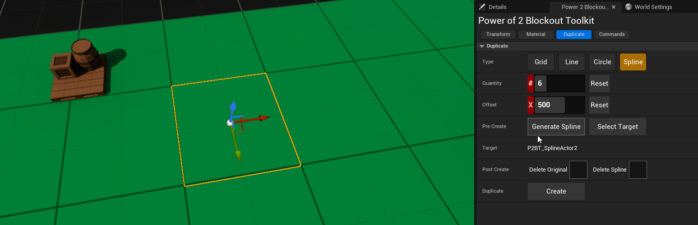

2. Notice the created spline, in this case P2BT_SplineActor3  
If you already had a spline, while the spline is selected, choose "Select Target"

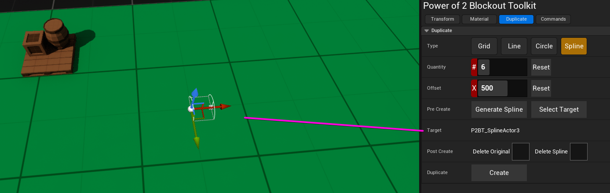

3. Using Alt and moving via the arrow transform will duplicate each node of the spline
    * manually rotate when necessary

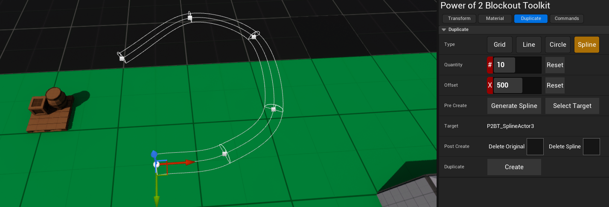

4. Select actors, verify quantity and offset, and duplicate!

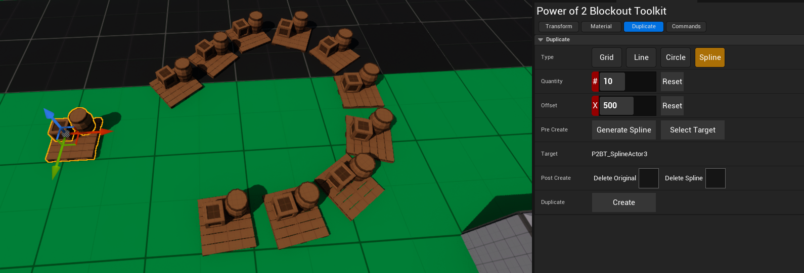

Note: Assuming you didn't delete it, the spline will auto-hide if unselected,
you can find via the outliner

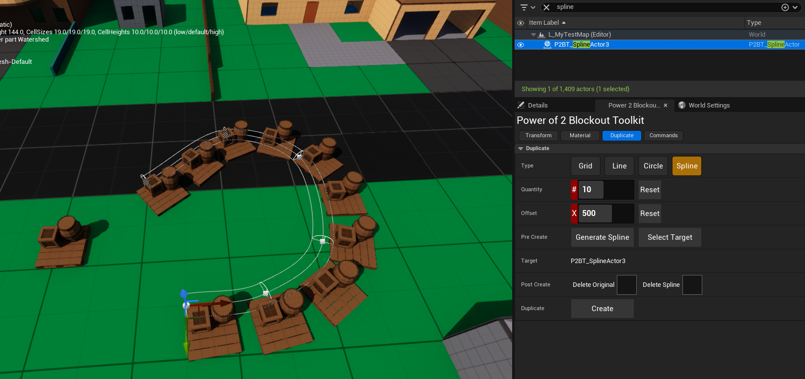

