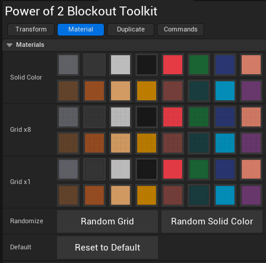

# Material Tab

## UI

## Materials

### Solid Color

Assigns the clicked color to the selected scene objects in the scene.
These are solid color materials.

### Grid x8

Assigns the clicked color to the selected scene objects in the scene.
This is a grid based material split evenly among x8 grid. Useful for many things.

### Grid x1

Assigns the clicked color to the selected scene objects in the scene.
This has a single grid, useful for larger scale objects, especially ground based pieces. 

### Randomize

* Randomly assign a grid color
* Randomly assign a solid color

### Default

* Reset to the selected object's default materials.

