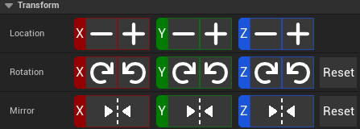

# Transform Tab

The Transform tab is used to move, rotate, and mirror selected objects. It also contains the grid settings and alignment tools.

## Transform

### Location

Translate the selected objects in the selected Axis by the grid scale amount. Typically 512cm x 512cm x 384cm or 0.5x or .25x of that.

You can set custom grid scale XY and Z values in the <HL>Project Settings -> Power of 2 Blockout Toolkit Settings</HL>

### Rotation

Rotate the selected objects in the selected Axis by 90 degrees. Most <HL>P2BT</HL> blocks are specifically designed to be rotated in 90 degree increments. If you are placing props or want more freedom, consider using Unreal Engine's default rotation tools.

### Mirror

Mirror the selected objects in the selected Axis. Not every P2BT block is designed to be mirrored, but many are. This will simply flip the sign on the selected axis.

## Grid

### Grid Scale

1.0|.5|.25|Custom
-|-|-|-
512cm|256cm|128cm|Set via project settings

### Snap Axis

Enable or disable snapping on the selected axis.
This only applies to P2BT <HL>AP2BTCellSnapActors</HL>

## Align

### AlignBounds

* Align the selected objects based upon the outer bounds of the selected objects.

### Aling Pivot

* Align the selected objects based upon the pivot of the selected objects.

### Distribute

* Distribute the selected objects evenly along the selected axis with equal spacing between each object's outer bounds.
* Distribute the selected objects evenly along the selected axis with equal spacing between each object's pivot.

## Settings

### Reset Rotation On Move

If checked, when moving a <HL>AP2BTCellSnapActor</HL> the rotation reset back to [0,0,0].

This is especially useful for floor pieces, which typically aren't designed to be rotated.
Though for walls and many pieces, this probably isn't the desired behavior.

