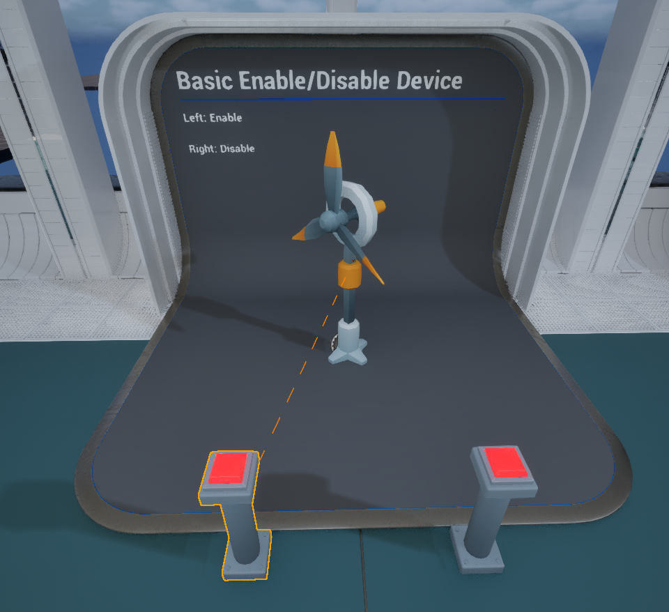
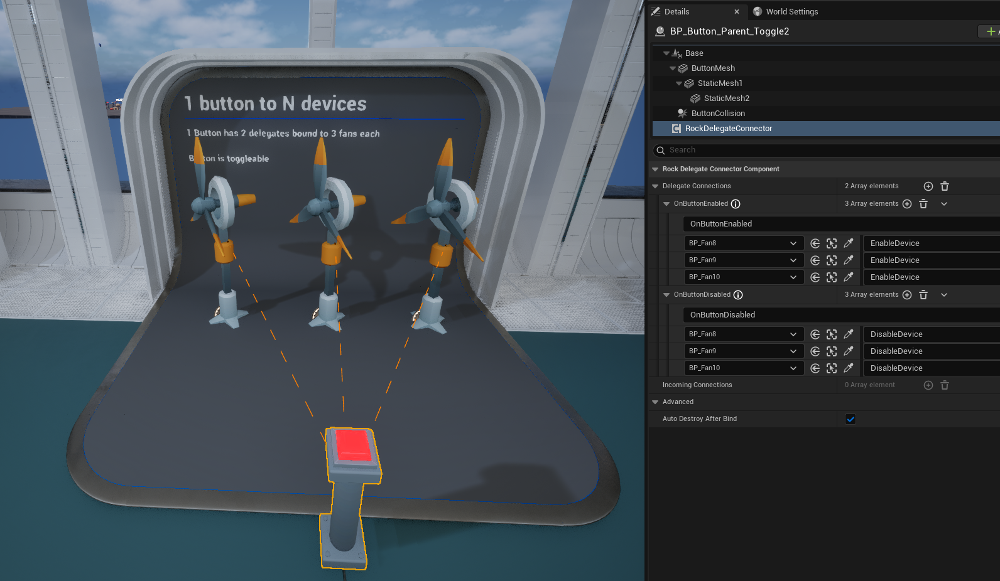
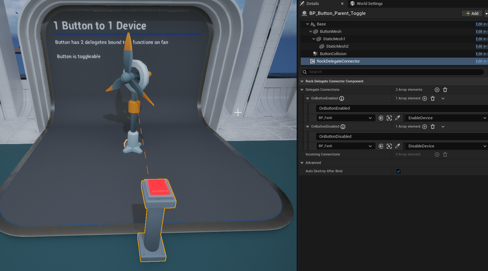
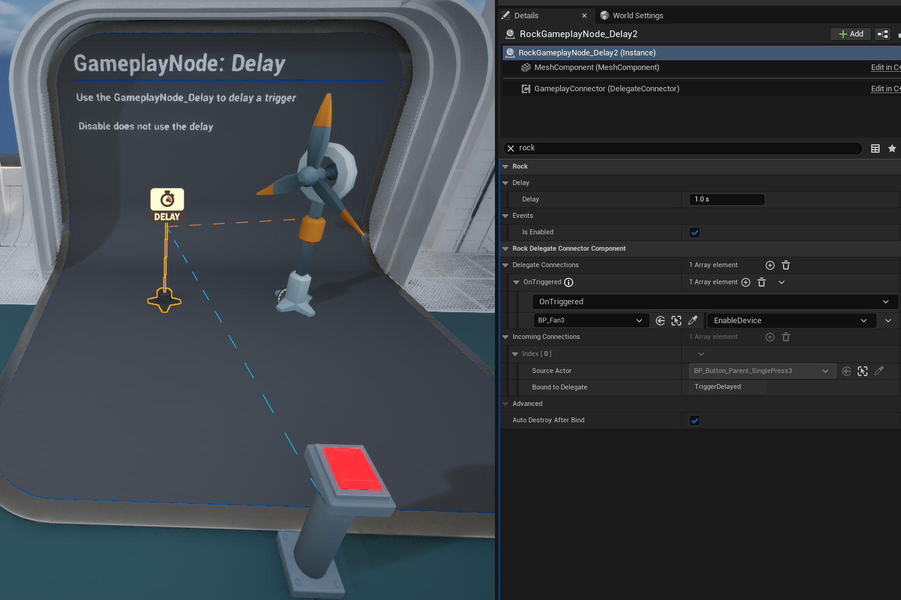
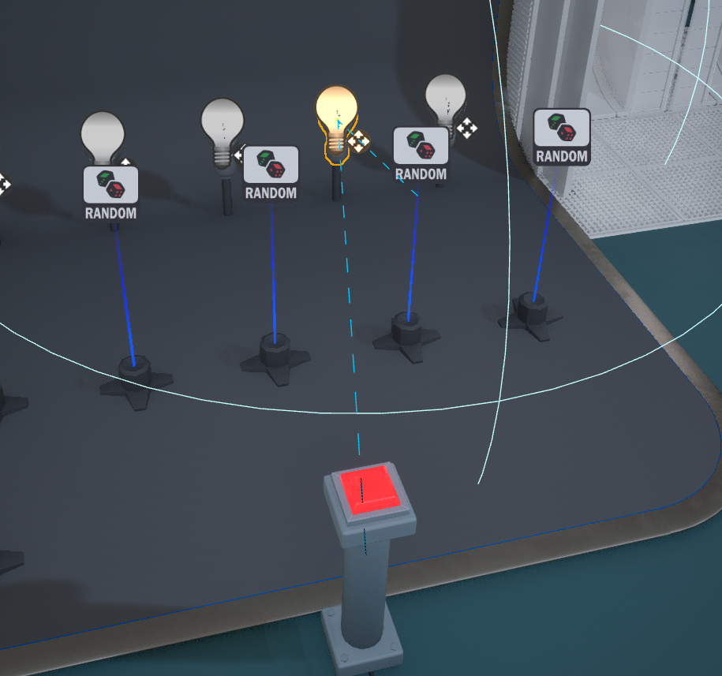
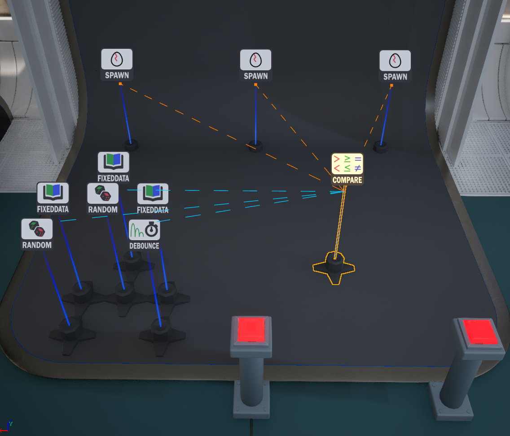

#  Example Project

Please check out the Demonstration project at github:

https://github.com/brokenrockstudios/RockGameplayEventsExample

There is a variety of scenarios from 1 to 1 actor hook ups to advanced scenarios.

Below is a non exhaustive list of the project's contents.

## 1:1 Actor hookup

1 button to 1 Fan

## 1:N Actor hookup

1 button to multiple Fans.

## 1:1 Actor with multiple delegates

A toggleable button that uses 2 delegates to hook into 2 functions on a device.

On/Off on the botton enable/disables the fan.

## Delay Node

1 button to enable a fan after a delay.

## Random Node

1 button goes through 5 random nodes to randomize which 5 lights are enabled.

## Advanced configuration

The advanced scenario utilizes the Debounce, Random, FixedData, Compare, and Spawn nodes.

To randomly spawn 1 of 3 actors at the same location.

:::info Tip

While this demonstration leverages 10 gameplay node actors. It would likely be better to write a custom gameplay node actor for your game's need.

However, there are use cases where one might only want to leverage existing functionality, and this is to demonstrate you can create more complex out of small building blocks of the Rock Gameplay Node Actors

:::

