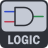
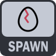

# Gameplay Node Actors


## RockGameplayNode

All gameplay node actors come with some basic functionality to enable and disable and a generally usable multicast OnTriggered. Different node actors will generally utilize it when they've been triggered, but may offer more specific multicast delegates as needed.

```cpp
void Enable(AActor* EventInstigator)
void Disable(AActor* EventInstigator)
void ResetNode(AActor* EventInstigator)
bool IsEnabled()
```

:::info Tip
All nodes can be called from Blueprints unless explicitly called out
:::

## Nodes

### Compare Node


Given InputA and InputB of a string will trigger one or more GameplayEvents representing the 6 various states of 

Symbol | Description
-|-
`==` | Equal
`!=` | Not Equal
`<`  | LessThan
`<=` | LessThanOrEqual
`>`  | GreaterThan
`>=` | GreaterThanOrEqual

Default value is "0"

:::info Tip
If both InputA and InputB are both numerical values, they will be converted to numerical prior to comparison
:::


### Debounce Node


Debounce node allows you to prevent multiple triggers from being overly active.

For example: If you try to trigger a debounce node 5 times within the cooldown period, it will only trigger once before the cooldown initiates.

You can configure the cooldown period, the default value is 1.0 seconds


:::info Tip
There is a bool QueueInputDuringCooldown option that will queue them up, and trigger them subsequentually after each cooldown period is reached.
Default behavior has this disabled
:::

:::warning Warning
Debounce does not support the usage of the EventInstigator actor at this time, though will likely support at a future date
:::


### Delay Node


This node will simply trigger after a set period of time from the initial call.
Default is 1 second.

If you attempt to trigger it multiple times, the timer will be reset and will only ever trigger after the set delay.


### Fixed Data Node


Some other nodes or functions might need some overriden data or extra parameters beyond the EventInstigator.
This has a variety of FixedData delegates that can pass on Strings, Ints, Floats, Bools, Vectors, Rotators, Transforms to other actor's events as needed.

:::info tip
Although usable and functionality as-is. This is primarily just demonstrating a potentially more complex gameplay node actor. Each game will likely want to expand upon this concept as needed per game.
:::


### FX Node


A gameplay node that would trigger particle systems, sounds, camerashake, and/or force feedback.
Inspired by the GameplayCueNotify_Burst

You can trigger some 1 off effects easily.

This Node Actor is for simple use cases. More advanced implementations might be needed on a per game basis.


### Logic Gate Node



A Logic Gate will take 2 inputs InputA On/Off, InputB On/Off.

It will trigger a OnTrue or OnFalse output depending upon a GateType.


GateTypes

Type|Description
-|-
AND | AND: True when A and B are true => (1,1)
OR | OR: True when A or B are true => (1,0), (0,1), (1,1)
XOR| Exclusive-OR: True when A and B are different => (0,1), (1,0)
NOT|Not: True when A is false. B is ignored => (0,*)
Buffer| Buffer True only when A is true. B is ignored. 
NAND|Not-AND: True in every scenario except when A and B are true => (0,0), (1,0), (0,1)
NOR | Not-OR: True when A and B are false => (0,0)
XNOR|Exclusive-NOR True when A and B are the same value => (0,0),(1,1)


### Random Node


When TriggerRandomSelection is called will trigger 1 of 2 delegates: OnTriggered or OnTriggered_Inverted

Using the actor defined TriggerPecentage.  If it's 10%,  the OnTriggered will be called 10% of the time, and OnTrigger_Inverted will be called 90% of the time.

You can also optionally set a Seed. A seed of 0 will use system time.


### Spawn Node



Will spawn an actor at a specified location.

Choose an ActorToSpawn, use the SpawnTransform Gizmo to set any desired offset and a MaxSpawnCount.

A MaxSpawnCount of -1 will be considered infinite.

Can call DestroyAllSpawnedActors to destroy all spawned actors.


### More Nodes Coming! 

Requests are welcome and invited!

If you have some ideas for new gameplay nodes. Feel free to file an issue requesting it at https://github.com/brokenrockstudios/RockGameplayEvents/issues

If it is something that would be usable to a variety of game genres, it will likely be added.

You may still need to implement some custom game specific nodes as you need.  Contact us if you need assistance with this. 


Thanks!


#### Bonus: 

Empty node icon to be used as a template for your own custom nodes!


