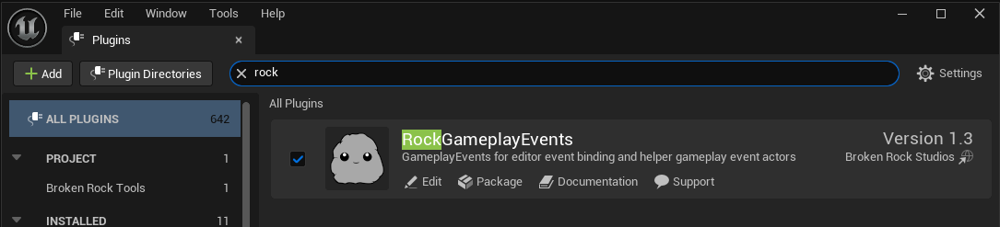

# Getting Started

## Installation

Rock Gameplay EVents can be installed through two methods.

### Marketplace Installation (Recommended)

1. Purchase Rock Gameplay Events from Unreal engine marketplace now known as FAB (fab.com)
2. Open the Epic Games Launcher
3. Navigate to the Library Tab
4. Find Rock Gameplay Events in your assets (Fab Library)
5. Click "Add To Engine"
6. Restart your project if it's currently open.
7. Open your project
8. Go to the Plugins tab and enable Rock Gameplay Events

9. Restart your project and enjoy!

### Github Installation

1. Visit the github repo (https://github.com/brokenrockstudios/RockGameplayEvents)
2. Clone or download the repository
3. Copy the plugin folder to your project's Plugins directory
4. If your project doesn't have a Plugins Directory, create one at the root level
5. Rebuild your project
6. Enable the plugin in Edit > Plugins > Rock Gameplay Events 

7. Restart your project and enjoy!

:::info Note
If your project is currently blueprint only, you need to add any C++ file via the editor to convert your BP project to a C++ supported one first.
:::

### Requirements

* Unreal Engine 5.5 or later
  * There isn't anything in the plugin that would prevent earlier versions of UE5 that I am aware of. However you'd have to export/reimport a few image files to downgrade.
* C++ Project (Blueprint only projects require a few additional setup of using Github installation)
* Basic understanding of Unreal Engine's Delegate System (e.g. Multicast Events)

## Initial Setup

After enabling the plugin.

You can either try adding a Rock Gameplay Event Node Actor to the level or adding a Rock Gameplay Connector Component to any actor. Either an instanced actor in a level or to an existing actor.  The Plugin support both Blueprint and C++.

